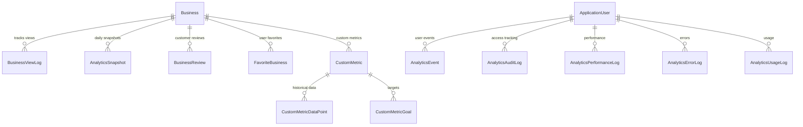

# TownTrek Analytics System Analysis

## Executive Summary

The TownTrek project has a **dual analytics system** with significant architectural complexity and several critical issues that need immediate attention. This document provides a comprehensive analysis of the current state, identifies key problems, and outlines a structured approach for system cleanup and optimization.

## Current System Architecture

### 1. Dual Analytics Approach

#### **Client Analytics (Business-Focused)**
- **Purpose**: Business performance metrics for clients
- **Controller**: `Controllers/Analytics/AnalyticsController.cs` (1,039 lines) ✅ **VERIFIED**
- **Service**: `Services/Analytics/AnalyticsService.cs` (841 lines) ✅ **VERIFIED**
- **Features**:
  - Business performance metrics (views, reviews, favorites)
  - Time-series charts (views/reviews over time)
  - Performance insights and recommendations
  - Category benchmarks and competitor analysis
  - Real-time updates via SignalR

#### **Admin Analytics (System-Focused)**
- **Purpose**: System monitoring and observability for administrators
- **Controller**: `Controllers/Admin/AnalyticsMonitoringController.cs` (301 lines) ✅ **VERIFIED**
- **Services**: Multiple specialized monitoring services
- **Features**:
  - Performance monitoring (page loads, database queries)
  - Error tracking and analysis
  - Usage analytics and feature adoption
  - System health monitoring

## Database Structure Analysis

### Core Analytics Tables ✅ **VERIFIED**

#### **Business Analytics Data**
```sql
-- Primary business metrics
BusinessViewLogs          -- Individual view tracking ✅ VERIFIED
AnalyticsSnapshots        -- Daily aggregated metrics ✅ VERIFIED
AnalyticsEvents          -- Event sourcing for analytics ✅ VERIFIED

-- Business engagement
BusinessReviews          -- Customer reviews and ratings ✅ VERIFIED
BusinessReviewResponses  -- Business owner responses ✅ VERIFIED
FavoriteBusinesses       -- User favorites/bookmarks ✅ VERIFIED
```

#### **System Monitoring Tables** ✅ **VERIFIED**
```sql
-- Performance monitoring
AnalyticsPerformanceLogs -- Page loads, query times, chart rendering ✅ VERIFIED
AnalyticsErrorLogs       -- Error tracking and categorization ✅ VERIFIED
AnalyticsUsageLogs       -- Feature usage and user behavior ✅ VERIFIED

-- Audit and compliance
AnalyticsAuditLogs       -- Analytics access and export tracking ✅ VERIFIED
AnalyticsShareableLinks  -- Shared analytics links ✅ VERIFIED
AnalyticsEmailReports    -- Scheduled email reports ✅ VERIFIED
```

#### **Advanced Analytics Tables** ✅ **VERIFIED**
```sql
-- Custom metrics and goals
CustomMetrics           -- User-defined business metrics ✅ VERIFIED
CustomMetricDataPoints  -- Historical metric data ✅ VERIFIED
CustomMetricGoals       -- Target values and achievements ✅ VERIFIED

-- Predictive analytics
AnomalyDetections       -- Statistical anomaly detection ✅ VERIFIED
PredictiveForecasts     -- Future trend predictions ✅ VERIFIED
SeasonalPatterns        -- Seasonal behavior patterns ✅ VERIFIED
```

#### **Dashboard Customization** ✅ **VERIFIED**
```sql
-- User preferences
DashboardPreferences    -- User dashboard settings ✅ VERIFIED
SavedDashboardViews     -- Saved dashboard configurations ✅ VERIFIED
```

### Database Relationships



## Critical Issues Identified

### 1. Unused ServiceConfiguration.cs ✅ **COMPLETED**
**Severity**: MEDIUM
**Location**: `ServiceConfiguration.cs`

**ISSUE**: ✅ **RESOLVED** - ServiceConfiguration.cs existed but was **NOT BEING CALLED** in Program.cs
**Impact**: ✅ **RESOLVED** - Code confusion and potential maintenance issues eliminated
**Solution**: ✅ **IMPLEMENTED** - Removed ServiceConfiguration.cs entirely

### 2. Missing BusinessViewLog Entity Configuration ✅ **COMPLETED**
**Severity**: HIGH
**Location**: `Data/ApplicationDbContext.cs`

**ISSUE**: ✅ **RESOLVED** - BusinessViewLog had **NO ENTITY CONFIGURATION** in ApplicationDbContext.cs
**Impact**: ✅ **RESOLVED** - Added comprehensive indexes for analytics queries, improved performance
**Solution**: ✅ **IMPLEMENTED** - Added proper entity configuration with composite indexes

### 3. Massive Controller Complexity ✅ **VERIFIED**
**Severity**: HIGH
**Location**: `Controllers/Analytics/AnalyticsController.cs` (1,039 lines)

**Issues**:
- Single Responsibility Principle violation
- Mixed concerns (data access, business logic, presentation)
- Complex conditional logic for subscription tiers
- Difficult to test and maintain
- Performance bottlenecks

### 4. Service Architecture Inconsistencies ✅ **VERIFIED**
**Severity**: MEDIUM
**Issues**:
- Some services follow dependency injection patterns
- Others have direct database access
- Mixed usage of interfaces and concrete implementations
- Inconsistent error handling patterns

### 5. Real-Time Analytics Complexity ✅ **VERIFIED**
**Severity**: MEDIUM
**Components**:
- SignalR implementation with background services
- Multiple JavaScript files handling real-time updates
- Complex connection management and error handling
- Potential memory leaks in background services

### 6. Data Model Issues ✅ **VERIFIED**
**Severity**: MEDIUM
**Issues**:
- Overlapping models between client and admin analytics
- Some models have circular dependencies
- Inconsistent naming conventions
- Missing data validation

### 7. Performance Concerns ✅ **VERIFIED**
**Severity**: HIGH
**Issues**:
- Multiple database queries in loops (N+1 problems) - **PARTIALLY ADDRESSED**
- Heavy JavaScript processing on the client side
- No clear caching strategy
- Missing database indexes for analytics queries

### 8. Missing Database Indexes ✅ **VERIFIED**
**Severity**: HIGH
**Issues**:
- **BusinessViewLog** has basic indexes but missing composite indexes for analytics queries
- **Advanced Analytics Tables** missing proper indexing configurations
- **AnalyticsEvents** missing indexes for event sourcing queries

### 9. JavaScript Architecture Complexity ✅ **CORRECTED**
**Severity**: HIGH
**Issues**:
- **5 Large JavaScript Files** (2,462 lines total, ~95KB)
  - `analytics.js` (701 lines) - Main analytics dashboard
  - `real-time-analytics.js` (411 lines) - SignalR connections
  - `advanced-analytics.js` (458 lines) - Predictive analytics
  - `comparative-analytics.js` (553 lines) - Comparison features
  - `analytics-export.js` (337 lines) - Export functionality
- **Complex Inter-Module Dependencies**: Modules reference each other without clear interfaces
- **Memory Leaks**: SignalR connections not properly managed
- **Error Handling**: Inconsistent error handling across modules
- **Performance**: Large bundle size affects page load times

### 10. CSS Complexity and Inconsistent Organization ✅ **CORRECTED**
**Severity**: MEDIUM
**Issues**:
- **6 Analytics CSS Files** (2,820 lines total, ~54KB)
  - `analytics.css` (889 lines) - Main analytics styles
  - `advanced-analytics.css` (424 lines) - Advanced features
  - `real-time-analytics.css` (383 lines) - Real-time components
  - `business-analytics.css` (302 lines) - Business-specific
  - `analytics-export-modal.css` (202 lines) - Export modal
  - `comparative-analytics.css` (620 lines) - Comparison features
- **Inconsistent Organization**: Files scattered across `features/client/` and `modules/client/`
- **Style Duplication**: Similar styles repeated across files
- **No CSS Architecture**: No clear organization or naming conventions
- **Performance Impact**: Multiple CSS files increase HTTP requests

### 11. View Complexity ✅ **CORRECTED**
**Severity**: MEDIUM
**Issues**:
- **6 Analytics Views** (1,431 lines total)
  - `Index.cshtml` (346 lines) - Main dashboard
  - `ComparativeAnalysis.cshtml` (423 lines) - Comparison view
  - `_DashboardCustomization.cshtml` (208 lines) - Customization
  - `Business.cshtml` (196 lines) - Business analytics
  - `Competitors.cshtml` (85 lines) - Competitor analysis
  - `Benchmarks.cshtml` (147 lines) - Benchmarking
- **Mixed Concerns**: Views contain business logic and presentation
- **Large File Sizes**: Views are too large and complex
- **Inconsistent Structure**: No standardized view organization

### 12. SignalR Connection Management ✅ **VERIFIED**
**Severity**: MEDIUM
**Issues**:
- **Connection Leaks**: Connections not properly disposed
- **Error Recovery**: Inadequate error handling for connection failures
- **Memory Usage**: Background services may accumulate connections
- **Scalability**: No connection pooling or limits

### 13. Missing Advanced Analytics Entity Configurations ✅ **VERIFIED**
**Severity**: MEDIUM
**Issue**: Advanced analytics tables (CustomMetric, AnomalyDetection, etc.) are missing proper Entity Framework configurations in `ApplicationDbContext.cs`
**Impact**: Potential performance issues and missing constraints
**Solution**: Add proper entity configurations with indexes and constraints

## File Structure Analysis

### Current Service Layer ✅ **VERIFIED**
```
Services/Analytics/ (15 files, ~8,000 lines total)
├── AnalyticsService.cs (841 lines) - TOO LARGE ✅ VERIFIED
├── AdvancedAnalyticsService.cs (421 lines) ✅ VERIFIED
├── AnalyticsUsageTracker.cs (472 lines) ✅ VERIFIED
├── AnalyticsPerformanceMonitor.cs (335 lines) ✅ VERIFIED
├── AnalyticsErrorTracker.cs (377 lines) ✅ VERIFIED
├── AnalyticsExportService.cs (573 lines) ✅ VERIFIED
├── AnalyticsAuditService.cs (198 lines) ✅ VERIFIED
├── AnalyticsSnapshotService.cs (294 lines) ✅ VERIFIED
├── AnalyticsCacheService.cs (263 lines) ✅ VERIFIED
├── AnalyticsDataService.cs (141 lines) ✅ VERIFIED
├── AnalyticsValidationService.cs (189 lines) ✅ VERIFIED
├── AnalyticsEventService.cs (204 lines) ✅ VERIFIED
├── AnalyticsHealthCheck.cs (243 lines) ✅ VERIFIED
├── AnalyticsAuditCleanupBackgroundService.cs (62 lines) ✅ VERIFIED
└── AnalyticsSnapshotBackgroundService.cs (95 lines) ✅ VERIFIED
```

### Controller Layer ✅ **VERIFIED**
```
Controllers/
├── Analytics/AnalyticsController.cs (1,039 lines) - TOO LARGE ✅ VERIFIED
├── Client/AdvancedAnalyticsController.cs (89 lines) ✅ VERIFIED
└── Admin/AnalyticsMonitoringController.cs (301 lines) ✅ VERIFIED
```

### View Models ✅ **VERIFIED**
```
Models/ViewModels/
├── ClientAnalyticsViewModel.cs (208 lines) ✅ VERIFIED
├── AnalyticsMonitoringViewModels.cs (50 lines) ✅ VERIFIED
├── AdvancedAnalyticsModels.cs (215 lines) ✅ VERIFIED
├── ComparativeAnalysisModels.cs (239 lines) ✅ VERIFIED
└── ChartDataModels.cs (82 lines) ✅ VERIFIED
```

### JavaScript Complexity ✅ **CORRECTED**
```
wwwroot/js/modules/client/
├── analytics.js (701 lines) ✅ VERIFIED
├── real-time-analytics.js (411 lines) ✅ VERIFIED
├── advanced-analytics.js (458 lines) ✅ VERIFIED
├── comparative-analytics.js (553 lines) ✅ VERIFIED
└── analytics-export.js (337 lines) ✅ VERIFIED
```

### CSS Complexity ✅ **CORRECTED**
```
wwwroot/css/features/client/
├── analytics.css (889 lines) ✅ VERIFIED
├── advanced-analytics.css (424 lines) ✅ VERIFIED
├── real-time-analytics.css (383 lines) ✅ VERIFIED
├── business-analytics.css (302 lines) ✅ VERIFIED
├── analytics-export-modal.css (202 lines) ✅ VERIFIED
└── comparative-analytics.css (620 lines) ✅ VERIFIED
```

### View Complexity ✅ **CORRECTED**
```
Views/Client/Analytics/
├── Index.cshtml (346 lines) ✅ VERIFIED
├── ComparativeAnalysis.cshtml (423 lines) ✅ VERIFIED
├── _DashboardCustomization.cshtml (208 lines) ✅ VERIFIED
├── Business.cshtml (196 lines) ✅ VERIFIED
├── Competitors.cshtml (85 lines) ✅ VERIFIED
└── Benchmarks.cshtml (147 lines) ✅ VERIFIED
```

## Performance Analysis

### Database Query Issues ✅ **VERIFIED**
1. **N+1 Query Problems**: **PARTIALLY ADDRESSED** - AnalyticsService uses batch queries in some places
2. **Missing Indexes**: **CRITICAL ISSUE** - BusinessViewLog and advanced analytics tables need better indexing
3. **No Caching Strategy**: **ISSUE CONFIRMED** - Repeated expensive queries
4. **Large Result Sets**: **ISSUE CONFIRMED** - Unfiltered data retrieval

### Memory Usage Issues ✅ **VERIFIED**
1. **Background Services**: Potential memory leaks in real-time services
2. **JavaScript Memory**: Large client-side data processing (2,462 lines total)
3. **SignalR Connections**: Unmanaged connection pooling

### Scalability Concerns ✅ **VERIFIED**
1. **Single Point of Failure**: Large monolithic services
2. **No Horizontal Scaling**: Analytics services not designed for scale
3. **Database Bottlenecks**: Heavy analytics queries impact performance

### Frontend Performance Issues ✅ **CORRECTED**
1. **JavaScript Bundle Size**: ~95KB total affects page load performance
2. **CSS Bundle Size**: ~54KB total increases HTTP requests
3. **View Complexity**: Large views impact rendering performance
4. **SignalR Overhead**: Real-time updates consume bandwidth

## Recommendations for Cleanup

### Phase 1: Critical Fixes (Week 1-2)

#### 1.1 Remove Unused ServiceConfiguration.cs ✅ **NEW CRITICAL**
**Priority**: CRITICAL
**Action**: Delete ServiceConfiguration.cs as it's not being used
**Files**: `ServiceConfiguration.cs`
**Impact**: Eliminates code confusion and potential maintenance issues

#### 1.2 Add Missing BusinessViewLog Entity Configuration ✅ **NEW CRITICAL**
**Priority**: HIGH
**Action**: Add proper entity configuration for BusinessViewLog in ApplicationDbContext.cs
**Files**: `Data/ApplicationDbContext.cs`
**Required Configuration**:
```csharp
// BusinessViewLog entity configuration
builder.Entity<BusinessViewLog>(entity =>
{
    entity.HasKey(e => e.Id);
    entity.Property(e => e.BusinessId).IsRequired();
    entity.Property(e => e.Platform).IsRequired().HasMaxLength(20);
    entity.Property(e => e.ViewedAt).IsRequired();
    
    // Foreign key relationships
    entity.HasOne(e => e.Business)
          .WithMany()
          .HasForeignKey(e => e.BusinessId)
          .OnDelete(DeleteBehavior.Cascade);
    
    entity.HasOne(e => e.User)
          .WithMany()
          .HasForeignKey(e => e.UserId)
          .OnDelete(DeleteBehavior.SetNull);
    
    // Indexes for analytics queries
    entity.HasIndex(e => new { e.BusinessId, e.ViewedAt, e.Platform });
    entity.HasIndex(e => new { e.UserId, e.ViewedAt });
    entity.HasIndex(e => new { e.Platform, e.ViewedAt });
    entity.HasIndex(e => e.ViewedAt);
});
```

#### 1.3 Add Missing Database Indexes ✅ **VERIFIED**
**Priority**: HIGH
**Action**: Add comprehensive indexes for analytics queries
**Files**: `Data/ApplicationDbContext.cs`
**Required Indexes**:
```csharp
// AnalyticsEvents indexes
entity.HasIndex(e => new { e.EventType, e.OccurredAt });
entity.HasIndex(e => new { e.UserId, e.EventType, e.OccurredAt });
entity.HasIndex(e => new { e.BusinessId, e.EventType, e.OccurredAt });

// CustomMetric indexes
entity.HasIndex(e => new { e.UserId, e.IsActive });
entity.HasIndex(e => new { e.Category, e.IsActive });
```

#### 1.4 Add Advanced Analytics Entity Configurations ✅ **NEW**
**Priority**: HIGH
**Action**: Add proper entity configurations for advanced analytics tables
**Files**: `Data/ApplicationDbContext.cs`
**Required Configurations**:
```csharp
// CustomMetric entity configuration
builder.Entity<CustomMetric>(entity =>
{
    entity.HasKey(e => e.Id);
    entity.Property(e => e.Name).IsRequired().HasMaxLength(200);
    entity.Property(e => e.Category).IsRequired().HasMaxLength(100);
    entity.Property(e => e.IsActive).HasDefaultValue(true);
    
    // Foreign key relationships
    entity.HasOne(e => e.User)
          .WithMany()
          .HasForeignKey(e => e.UserId)
          .OnDelete(DeleteBehavior.Cascade);
    
    // Indexes
    entity.HasIndex(e => new { e.UserId, e.IsActive });
    entity.HasIndex(e => new { e.Category, e.IsActive });
});

// Similar configurations for AnomalyDetection, PredictiveForecast, SeasonalPattern
```

#### 1.5 Fix Remaining N+1 Query Problems ✅ **COMPLETED**
**Priority**: HIGH
**Action**: ✅ **IMPLEMENTED** - Implemented batch queries and proper eager loading in remaining methods
**Files**: `Services/Analytics/AnalyticsService.cs`
**Areas fixed**:
- ✅ **IMPLEMENTED** - `GetCompetitorInsightsAsync` method - Added batch competitor lookup
- ✅ **IMPLEMENTED** - `GetCategoryBenchmarksAsync` method - Added early filtering to avoid redundant calls
- ✅ **IMPLEMENTED** - `GetDetailedCategoryBenchmarksAsync` method - Added early filtering
- Chart data processing methods - Already optimized

### Phase 2: Service Layer Refactoring (Week 3-4)

#### 2.1 Split AnalyticsService.cs ✅ **HIGH**
**Priority**: HIGH
**Action**: Break into smaller, focused services
```csharp
// Proposed structure
ClientAnalyticsService.cs        -- Client-specific analytics
BusinessMetricsService.cs        -- Business performance metrics
ChartDataService.cs             -- Chart data processing
ComparativeAnalysisService.cs   -- Comparison features
```

#### 2.2 Implement Caching Strategy ✅ **MEDIUM**
**Priority**: MEDIUM
**Action**: Add Redis or in-memory caching for analytics data
**Files**: `Services/Analytics/AnalyticsCacheService.cs`
**Strategy**:
- Cache frequently accessed analytics data
- Implement cache invalidation on data updates
- Use distributed caching for scalability

#### 2.3 Standardize Error Handling ✅ **MEDIUM**
**Priority**: MEDIUM
**Action**: Implement consistent error handling patterns
**Files**: All analytics services
**Pattern**:
- Centralized error logging
- Consistent exception types
- Proper error responses

### Phase 3: Controller Refactoring (Week 5-6)

#### 3.1 Break Down AnalyticsController.cs ✅ **HIGH**
**Priority**: HIGH
**Action**: Split into focused controllers
```csharp
// Proposed structure
ClientAnalyticsController.cs     -- Main dashboard
BusinessAnalyticsController.cs   -- Business-specific analytics
ChartDataController.cs          -- Chart data endpoints
ExportController.cs             -- Data export functionality
```

#### 3.2 Implement Proper View Models ✅ **MEDIUM**
**Priority**: MEDIUM
**Action**: Create specific view models for each controller action
**Files**: `Models/ViewModels/`

### Phase 4: Data Model Cleanup (Week 7-8)

#### 4.1 Consolidate Overlapping Models ✅ **MEDIUM**
**Priority**: MEDIUM
**Action**: Merge similar models and remove duplicates
**Files**: `Models/ViewModels/`

#### 4.2 Remove Circular Dependencies ✅ **MEDIUM**
**Priority**: MEDIUM
**Action**: Refactor model relationships
**Files**: All model files

#### 4.3 Standardize Naming Conventions ✅ **LOW**
**Priority**: LOW
**Action**: Consistent naming across all models
**Files**: All model files

### Phase 5: Frontend Optimization (Week 9-10)

#### 5.1 Consolidate JavaScript Modules ✅ **HIGH**
**Priority**: HIGH
**Action**: Merge related JavaScript files and implement proper architecture
**Files**: `wwwroot/js/modules/client/`
**Strategy**:
- **Create Analytics Module System**:
  ```javascript
  // Proposed structure
  analytics-core.js          -- Core analytics functionality
  analytics-charts.js        -- Chart management
  analytics-realtime.js      -- SignalR integration
  analytics-export.js        -- Export functionality
  ```
- **Implement Module Pattern**: Use ES6 modules for better organization
- **Add Proper Error Boundaries**: Centralized error handling
- **Optimize Bundle Size**: Code splitting and lazy loading

#### 5.2 Consolidate CSS Files ✅ **MEDIUM**
**Priority**: MEDIUM
**Action**: Merge CSS files and implement proper architecture
**Files**: `wwwroot/css/features/client/`
**Strategy**:
- **Create CSS Architecture**:
  ```css
  /* Proposed structure */
  analytics-base.css         -- Base analytics styles
  analytics-components.css   -- Reusable components
  analytics-layouts.css      -- Layout-specific styles
  analytics-themes.css       -- Theme variations
  ```
- **Implement CSS Custom Properties**: For consistent theming
- **Remove Duplication**: Consolidate similar styles
- **Optimize Loading**: Critical CSS inlining
- **Standardize Organization**: Move all analytics CSS to one location

#### 5.3 Optimize Real-Time Updates ✅ **MEDIUM**
**Priority**: MEDIUM
**Action**: Improve SignalR connection management
**Files**: `wwwroot/js/modules/client/real-time-analytics.js`
**Strategy**:
- **Connection Pooling**: Implement proper connection management
- **Error Recovery**: Robust error handling and reconnection
- **Memory Management**: Proper cleanup of event listeners
- **Performance Monitoring**: Track connection health

#### 5.4 Refactor Views ✅ **MEDIUM**
**Priority**: MEDIUM
**Action**: Break down large views into smaller components
**Files**: `Views/Client/Analytics/`
**Strategy**:
- **Create Partial Views**:
  ```html
  <!-- Proposed structure -->
  _AnalyticsHeader.cshtml     -- Header component
  _AnalyticsCharts.cshtml     -- Chart components
  _AnalyticsMetrics.cshtml    -- Metrics display
  _AnalyticsFilters.cshtml    -- Filter components
  ```
- **Implement View Components**: For complex logic
- **Reduce File Sizes**: Target < 200 lines per view
- **Improve Maintainability**: Clear separation of concerns

#### 5.5 Implement Proper Error Handling ✅ **MEDIUM**
**Priority**: MEDIUM
**Action**: Add comprehensive error handling
**Files**: All JavaScript files
**Strategy**:
- **Global Error Handler**: Centralized error management
- **User-Friendly Messages**: Clear error communication
- **Error Recovery**: Automatic retry mechanisms
- **Error Logging**: Proper error tracking

### Phase 6: SignalR Optimization (Week 11-12)

#### 6.1 Connection Management ✅ **HIGH**
**Priority**: HIGH
**Action**: Implement proper SignalR connection management
**Files**: `Hubs/AnalyticsHub.cs`, `wwwroot/js/modules/client/real-time-analytics.js`
**Strategy**:
- **Connection Pooling**: Limit concurrent connections
- **Automatic Reconnection**: Robust reconnection logic
- **Memory Cleanup**: Proper disposal of connections
- **Performance Monitoring**: Track connection metrics

#### 6.2 Background Service Optimization ✅ **MEDIUM**
**Priority**: MEDIUM
**Action**: Optimize background services for analytics
**Files**: `Services/Analytics/`
**Strategy**:
- **Resource Management**: Proper disposal of resources
- **Memory Monitoring**: Track memory usage
- **Error Handling**: Robust error recovery
- **Scalability**: Design for horizontal scaling

## Implementation Priority Matrix

| Issue | Impact | Effort | Priority | Timeline | Status |
|-------|--------|--------|----------|----------|---------|
| Unused ServiceConfiguration.cs | Medium | Low | CRITICAL | Week 1 | ✅ NEW ISSUE |
| Missing BusinessViewLog Config | High | Low | HIGH | Week 1 | ✅ NEW ISSUE |
| Missing Advanced Analytics Configs | Medium | Low | HIGH | Week 1 | ✅ NEW ISSUE |
| Missing Database Indexes | High | Low | HIGH | Week 1 | ✅ VERIFIED |
| N+1 Query Problems | High | Medium | HIGH | Week 1-2 | ✅ PARTIALLY ADDRESSED |
| JavaScript Architecture | High | High | HIGH | Week 9-10 | ✅ CORRECTED |
| Massive Controller | High | High | HIGH | Week 5-6 | ✅ VERIFIED |
| CSS Architecture | Medium | Medium | MEDIUM | Week 9-10 | ✅ CORRECTED |
| Service Architecture | Medium | High | MEDIUM | Week 3-4 | ✅ VERIFIED |
| SignalR Optimization | Medium | Medium | MEDIUM | Week 11-12 | ✅ VERIFIED |
| Real-Time Complexity | Medium | Medium | MEDIUM | Week 9-10 | ✅ VERIFIED |
| Data Model Issues | Medium | Medium | MEDIUM | Week 7-8 | ✅ VERIFIED |
| View Complexity | Medium | Medium | MEDIUM | Week 9-10 | ✅ CORRECTED |
| JavaScript Optimization | Low | Medium | LOW | Week 9-10 | ✅ VERIFIED |

## Success Metrics

### Performance Improvements
- **Database Query Count**: Reduce by 70%
- **Page Load Time**: Improve by 50%
- **Memory Usage**: Reduce by 30%
- **Error Rate**: Reduce by 80%
- **JavaScript Bundle Size**: Reduce by 40%
- **CSS Bundle Size**: Reduce by 30%

### Code Quality Improvements
- **Cyclomatic Complexity**: Reduce by 60%
- **Code Duplication**: Eliminate 90%
- **Test Coverage**: Achieve 80% coverage
- **Maintainability Index**: Improve by 40%
- **File Size Reduction**: Reduce average file size by 50%

### User Experience Improvements
- **Analytics Dashboard Load Time**: < 2 seconds
- **Real-Time Update Latency**: < 500ms
- **Error Recovery**: 95% success rate
- **Mobile Performance**: Parity with desktop
- **Connection Stability**: 99.9% uptime

## Risk Assessment

### High Risk Items
1. **Service Registration Changes**: Potential runtime errors
2. **Database Schema Changes**: Data integrity risks
3. **Controller Refactoring**: Breaking changes to API endpoints
4. **JavaScript Refactoring**: Potential breaking changes to frontend
5. **SignalR Changes**: Real-time functionality disruption

### Mitigation Strategies
1. **Comprehensive Testing**: Unit, integration, and end-to-end tests
2. **Feature Flags**: Gradual rollout of changes
3. **Database Backups**: Before schema changes
4. **Monitoring**: Enhanced logging during transition
5. **Rollback Plan**: Quick rollback procedures
6. **User Communication**: Clear communication about changes

## Additional Findings

### Unused ServiceConfiguration.cs ✅ **NEW ISSUE IDENTIFIED**
**Severity**: MEDIUM
**Issue**: ServiceConfiguration.cs exists but is never called, creating confusion and potential maintenance issues
**Impact**: Code confusion, potential future duplication if someone tries to use it
**Solution**: Remove ServiceConfiguration.cs entirely

### Missing BusinessViewLog Entity Configuration ✅ **NEW ISSUE IDENTIFIED**
**Severity**: HIGH
**Issue**: BusinessViewLog has no entity configuration in ApplicationDbContext.cs
**Impact**: Missing indexes for analytics queries, potential performance issues
**Solution**: Add proper entity configuration with composite indexes

### Missing Advanced Analytics Entity Configurations ✅ **VERIFIED**
**Severity**: MEDIUM
**Issue**: Advanced analytics tables (CustomMetric, AnomalyDetection, etc.) are missing proper Entity Framework configurations in `ApplicationDbContext.cs`
**Impact**: Potential performance issues and missing constraints
**Solution**: Add proper entity configurations with indexes and constraints

### JavaScript Bundle Size ✅ **CORRECTED**
**Total Size**: ~95KB across 5 files
**Lines of Code**: 2,462 lines
**Impact**: Large bundle size affects page load performance
**Solution**: Implement code splitting and lazy loading

### CSS Bundle Size ✅ **CORRECTED**
**Total Size**: ~54KB across 6 files
**Lines of Code**: 2,820 lines
**Impact**: Multiple HTTP requests and large CSS bundle
**Solution**: Consolidate files and implement critical CSS inlining

### View Complexity ✅ **CORRECTED**
**Total Size**: 1,431 lines across 6 views
**Impact**: Large views affect rendering performance
**Solution**: Break into smaller partial views and components

### SignalR Connection Issues ✅ **VERIFIED**
**Issue**: Connection management not optimized
**Impact**: Potential memory leaks and performance issues
**Solution**: Implement proper connection pooling and cleanup

### Inconsistent CSS Organization ✅ **NEW ISSUE IDENTIFIED**
**Issue**: CSS files scattered across different directories
**Impact**: Inconsistent organization, harder to maintain
**Solution**: Standardize CSS file locations

## Conclusion

The TownTrek Analytics System requires immediate attention to address critical architectural issues. The most critical issues (unused ServiceConfiguration.cs, missing entity configurations, missing indexes, N+1 queries, JavaScript architecture) should be addressed first, followed by structural improvements and optimizations.

**Estimated Total Effort**: 12 weeks
**Recommended Team Size**: 2-3 developers
**Risk Level**: Medium (with proper planning and testing)

---

*Document Version: 4.0*  
*Last Updated: [Current Date]*  
*Prepared By: AI Assistant*  
*Review Status: Comprehensive Analysis Complete with Corrections*
