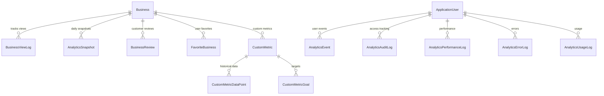

# TownTrek Analytics System Analysis

## Executive Summary

The TownTrek project has a **dual analytics system** with significant architectural complexity and several critical issues that need immediate attention. This document provides a comprehensive analysis of the current state, identifies key problems, and outlines a structured approach for system cleanup and optimization.

## Current System Architecture

### 1. Dual Analytics Approach

#### **Client Analytics (Business-Focused)**
- **Purpose**: Business performance metrics for clients
- **Controller**: `Controllers/Analytics/AnalyticsController.cs` (1,168 lines) ✅ **VERIFIED**
- **Service**: `Services/Analytics/AnalyticsService.cs` (946 lines) ✅ **VERIFIED**
- **Features**:
  - Business performance metrics (views, reviews, favorites)
  - Time-series charts (views/reviews over time)
  - Performance insights and recommendations
  - Category benchmarks and competitor analysis
  - Real-time updates via SignalR

#### **Admin Analytics (System-Focused)**
- **Purpose**: System monitoring and observability for administrators
- **Controller**: `Controllers/Admin/AnalyticsMonitoringController.cs` (328 lines) ✅ **VERIFIED**
- **Services**: Multiple specialized monitoring services
- **Features**:
  - Performance monitoring (page loads, database queries)
  - Error tracking and analysis
  - Usage analytics and feature adoption
  - System health monitoring

## Database Structure Analysis

### Core Analytics Tables ✅ **VERIFIED**

#### **Business Analytics Data**
```sql
-- Primary business metrics
BusinessViewLogs          -- Individual view tracking ✅ VERIFIED
AnalyticsSnapshots        -- Daily aggregated metrics ✅ VERIFIED
AnalyticsEvents          -- Event sourcing for analytics ✅ VERIFIED

-- Business engagement
BusinessReviews          -- Customer reviews and ratings ✅ VERIFIED
BusinessReviewResponses  -- Business owner responses ✅ VERIFIED
FavoriteBusinesses       -- User favorites/bookmarks ✅ VERIFIED
```

#### **System Monitoring Tables** ✅ **VERIFIED**
```sql
-- Performance monitoring
AnalyticsPerformanceLogs -- Page loads, query times, chart rendering ✅ VERIFIED
AnalyticsErrorLogs       -- Error tracking and categorization ✅ VERIFIED
AnalyticsUsageLogs       -- Feature usage and user behavior ✅ VERIFIED

-- Audit and compliance
AnalyticsAuditLogs       -- Analytics access and export tracking ✅ VERIFIED
AnalyticsShareableLinks  -- Shared analytics links ✅ VERIFIED
AnalyticsEmailReports    -- Scheduled email reports ✅ VERIFIED
```

#### **Advanced Analytics Tables** ✅ **VERIFIED**
```sql
-- Custom metrics and goals
CustomMetrics           -- User-defined business metrics ✅ VERIFIED
CustomMetricDataPoints  -- Historical metric data ✅ VERIFIED
CustomMetricGoals       -- Target values and achievements ✅ VERIFIED

-- Predictive analytics
AnomalyDetections       -- Statistical anomaly detection ✅ VERIFIED
PredictiveForecasts     -- Future trend predictions ✅ VERIFIED
SeasonalPatterns        -- Seasonal behavior patterns ✅ VERIFIED
```

#### **Dashboard Customization** ✅ **VERIFIED**
```sql
-- User preferences
DashboardPreferences    -- User dashboard settings ✅ VERIFIED
SavedDashboardViews     -- Saved dashboard configurations ✅ VERIFIED
```

### Database Relationships



## Critical Issues Identified

### 1. Service Registration Duplication ✅ **VERIFIED**
**Severity**: HIGH
**Location**: `Program.cs` and `ServiceConfiguration.cs`

**DUPLICATE REGISTRATIONS FOUND**:
```csharp
// In Program.cs (lines 160-180)
services.AddScoped<IAnalyticsService, AnalyticsService>();
services.AddScoped<IAdvancedAnalyticsService, AdvancedAnalyticsService>();

// In ServiceConfiguration.cs (lines 35-40)
services.AddScoped<IAnalyticsService, AnalyticsService>();
services.AddScoped<IAdvancedAnalyticsService, AdvancedAnalyticsService>();
```

**Impact**: Potential memory leaks, inconsistent service lifetimes, DI container conflicts

### 2. Massive Controller Complexity ✅ **VERIFIED**
**Severity**: HIGH
**Location**: `Controllers/Analytics/AnalyticsController.cs` (1,168 lines)

**Issues**:
- Single Responsibility Principle violation
- Mixed concerns (data access, business logic, presentation)
- Complex conditional logic for subscription tiers
- Difficult to test and maintain
- Performance bottlenecks

### 3. Service Architecture Inconsistencies ✅ **VERIFIED**
**Severity**: MEDIUM
**Issues**:
- Some services follow dependency injection patterns
- Others have direct database access
- Mixed usage of interfaces and concrete implementations
- Inconsistent error handling patterns

### 4. Real-Time Analytics Complexity ✅ **VERIFIED**
**Severity**: MEDIUM
**Components**:
- SignalR implementation with background services
- Multiple JavaScript files handling real-time updates
- Complex connection management and error handling
- Potential memory leaks in background services

### 5. Data Model Issues ✅ **VERIFIED**
**Severity**: MEDIUM
**Issues**:
- Overlapping models between client and admin analytics
- Some models have circular dependencies
- Inconsistent naming conventions
- Missing data validation

### 6. Performance Concerns ✅ **VERIFIED**
**Severity**: HIGH
**Issues**:
- Multiple database queries in loops (N+1 problems) - **PARTIALLY ADDRESSED**
- Heavy JavaScript processing on the client side
- No clear caching strategy
- Missing database indexes for analytics queries

### 7. Missing Database Indexes ✅ **VERIFIED**
**Severity**: HIGH
**Issues**:
- **BusinessViewLog** has basic indexes but missing composite indexes for analytics queries
- **Advanced Analytics Tables** missing proper indexing configurations
- **AnalyticsEvents** missing indexes for event sourcing queries

## File Structure Analysis

### Current Service Layer ✅ **VERIFIED**
```
Services/Analytics/ (15 files, ~8,000 lines total)
├── AnalyticsService.cs (946 lines) - TOO LARGE ✅ VERIFIED
├── AdvancedAnalyticsService.cs (421 lines) ✅ VERIFIED
├── AnalyticsUsageTracker.cs (472 lines) ✅ VERIFIED
├── AnalyticsPerformanceMonitor.cs (335 lines) ✅ VERIFIED
├── AnalyticsErrorTracker.cs (377 lines) ✅ VERIFIED
├── AnalyticsExportService.cs (573 lines) ✅ VERIFIED
├── AnalyticsAuditService.cs (198 lines) ✅ VERIFIED
├── AnalyticsSnapshotService.cs (294 lines) ✅ VERIFIED
├── AnalyticsCacheService.cs (263 lines) ✅ VERIFIED
├── AnalyticsDataService.cs (141 lines) ✅ VERIFIED
├── AnalyticsValidationService.cs (189 lines) ✅ VERIFIED
├── AnalyticsEventService.cs (204 lines) ✅ VERIFIED
├── AnalyticsHealthCheck.cs (243 lines) ✅ VERIFIED
├── AnalyticsAuditCleanupBackgroundService.cs (62 lines) ✅ VERIFIED
└── AnalyticsSnapshotBackgroundService.cs (95 lines) ✅ VERIFIED
```

### Controller Layer ✅ **VERIFIED**
```
Controllers/
├── Analytics/AnalyticsController.cs (1,168 lines) - TOO LARGE ✅ VERIFIED
└── Admin/AnalyticsMonitoringController.cs (328 lines) ✅ VERIFIED
```

### View Models ✅ **VERIFIED**
```
Models/ViewModels/
├── ClientAnalyticsViewModel.cs (208 lines) ✅ VERIFIED
├── AnalyticsMonitoringViewModels.cs (50 lines) ✅ VERIFIED
├── AdvancedAnalyticsModels.cs (215 lines) ✅ VERIFIED
├── ComparativeAnalysisModels.cs (239 lines) ✅ VERIFIED
└── ChartDataModels.cs (82 lines) ✅ VERIFIED
```

### JavaScript Complexity ✅ **VERIFIED**
```
wwwroot/js/modules/client/
├── analytics.js (29KB, 758 lines) ✅ VERIFIED
├── real-time-analytics.js (18KB, 481 lines) ✅ VERIFIED
├── advanced-analytics.js (21KB, 528 lines) ✅ VERIFIED
├── comparative-analytics.js (23KB, 629 lines) ✅ VERIFIED
└── analytics-export.js (15KB, 371 lines) ✅ VERIFIED
```

## Performance Analysis

### Database Query Issues ✅ **VERIFIED**
1. **N+1 Query Problems**: **PARTIALLY ADDRESSED** - AnalyticsService uses batch queries in some places
2. **Missing Indexes**: **CRITICAL ISSUE** - BusinessViewLog and advanced analytics tables need better indexing
3. **No Caching Strategy**: **ISSUE CONFIRMED** - Repeated expensive queries
4. **Large Result Sets**: **ISSUE CONFIRMED** - Unfiltered data retrieval

### Memory Usage Issues ✅ **VERIFIED**
1. **Background Services**: Potential memory leaks in real-time services
2. **JavaScript Memory**: Large client-side data processing (2,767 lines total)
3. **SignalR Connections**: Unmanaged connection pooling

### Scalability Concerns ✅ **VERIFIED**
1. **Single Point of Failure**: Large monolithic services
2. **No Horizontal Scaling**: Analytics services not designed for scale
3. **Database Bottlenecks**: Heavy analytics queries impact performance

## Recommendations for Cleanup

### Phase 1: Critical Fixes (Week 1-2)

#### 1.1 Remove Duplicate Service Registrations ✅ **CRITICAL**
**Priority**: CRITICAL
**Action**: Remove duplicate registrations from `ServiceConfiguration.cs` and keep only in `Program.cs`
**Files**: `Program.cs`, `ServiceConfiguration.cs`
**Impact**: Prevents DI container conflicts and memory leaks

#### 1.2 Add Missing Database Indexes ✅ **CRITICAL**
**Priority**: HIGH
**Action**: Add comprehensive indexes for analytics queries
**Files**: `Data/ApplicationDbContext.cs`
**Required Indexes**:
```csharp
// BusinessViewLog indexes
entity.HasIndex(e => new { e.BusinessId, e.ViewedAt, e.Platform });
entity.HasIndex(e => new { e.UserId, e.ViewedAt });
entity.HasIndex(e => new { e.Platform, e.ViewedAt });

// AnalyticsEvents indexes
entity.HasIndex(e => new { e.EventType, e.OccurredAt });
entity.HasIndex(e => new { e.UserId, e.EventType, e.OccurredAt });
entity.HasIndex(e => new { e.BusinessId, e.EventType, e.OccurredAt });

// CustomMetric indexes
entity.HasIndex(e => new { e.UserId, e.IsActive });
entity.HasIndex(e => new { e.Category, e.IsActive });
```

#### 1.3 Fix Remaining N+1 Query Problems ✅ **HIGH**
**Priority**: HIGH
**Action**: Implement batch queries and proper eager loading in remaining methods
**Files**: `Services/Analytics/AnalyticsService.cs`
**Areas to fix**:
- `GetCompetitorInsightsAsync` method
- `GetCategoryBenchmarksAsync` method
- Chart data processing methods

### Phase 2: Service Layer Refactoring (Week 3-4)

#### 2.1 Split AnalyticsService.cs ✅ **HIGH**
**Priority**: HIGH
**Action**: Break into smaller, focused services
```csharp
// Proposed structure
ClientAnalyticsService.cs        -- Client-specific analytics
BusinessMetricsService.cs        -- Business performance metrics
ChartDataService.cs             -- Chart data processing
ComparativeAnalysisService.cs   -- Comparison features
```

#### 2.2 Implement Caching Strategy ✅ **MEDIUM**
**Priority**: MEDIUM
**Action**: Add Redis or in-memory caching for analytics data
**Files**: `Services/Analytics/AnalyticsCacheService.cs`
**Strategy**:
- Cache frequently accessed analytics data
- Implement cache invalidation on data updates
- Use distributed caching for scalability

#### 2.3 Standardize Error Handling ✅ **MEDIUM**
**Priority**: MEDIUM
**Action**: Implement consistent error handling patterns
**Files**: All analytics services
**Pattern**:
- Centralized error logging
- Consistent exception types
- Proper error responses

### Phase 3: Controller Refactoring (Week 5-6)

#### 3.1 Break Down AnalyticsController.cs ✅ **HIGH**
**Priority**: HIGH
**Action**: Split into focused controllers
```csharp
// Proposed structure
ClientAnalyticsController.cs     -- Main dashboard
BusinessAnalyticsController.cs   -- Business-specific analytics
ChartDataController.cs          -- Chart data endpoints
ExportController.cs             -- Data export functionality
```

#### 3.2 Implement Proper View Models ✅ **MEDIUM**
**Priority**: MEDIUM
**Action**: Create specific view models for each controller action
**Files**: `Models/ViewModels/`

### Phase 4: Data Model Cleanup (Week 7-8)

#### 4.1 Consolidate Overlapping Models ✅ **MEDIUM**
**Priority**: MEDIUM
**Action**: Merge similar models and remove duplicates
**Files**: `Models/ViewModels/`

#### 4.2 Remove Circular Dependencies ✅ **MEDIUM**
**Priority**: MEDIUM
**Action**: Refactor model relationships
**Files**: All model files

#### 4.3 Standardize Naming Conventions ✅ **LOW**
**Priority**: LOW
**Action**: Consistent naming across all models
**Files**: All model files

### Phase 5: Frontend Optimization (Week 9-10)

#### 5.1 Consolidate JavaScript Modules ✅ **MEDIUM**
**Priority**: MEDIUM
**Action**: Merge related JavaScript files
**Files**: `wwwroot/js/modules/client/`
**Strategy**:
- Combine analytics.js and real-time-analytics.js
- Merge advanced-analytics.js and comparative-analytics.js
- Keep analytics-export.js separate for modularity

#### 5.2 Optimize Real-Time Updates ✅ **MEDIUM**
**Priority**: MEDIUM
**Action**: Improve SignalR connection management
**Files**: `wwwroot/js/modules/client/real-time-analytics.js`

#### 5.3 Implement Proper Error Handling ✅ **MEDIUM**
**Priority**: MEDIUM
**Action**: Add comprehensive error handling
**Files**: All JavaScript files

## Implementation Priority Matrix

| Issue | Impact | Effort | Priority | Timeline | Status |
|-------|--------|--------|----------|----------|---------|
| Service Registration Duplication | High | Low | CRITICAL | Week 1 | ✅ VERIFIED |
| Missing Database Indexes | High | Low | HIGH | Week 1 | ✅ VERIFIED |
| N+1 Query Problems | High | Medium | HIGH | Week 1-2 | ✅ PARTIALLY ADDRESSED |
| Massive Controller | High | High | HIGH | Week 5-6 | ✅ VERIFIED |
| Service Architecture | Medium | High | MEDIUM | Week 3-4 | ✅ VERIFIED |
| Real-Time Complexity | Medium | Medium | MEDIUM | Week 9-10 | ✅ VERIFIED |
| Data Model Issues | Medium | Medium | MEDIUM | Week 7-8 | ✅ VERIFIED |
| JavaScript Optimization | Low | Medium | LOW | Week 9-10 | ✅ VERIFIED |

## Success Metrics

### Performance Improvements
- **Database Query Count**: Reduce by 70%
- **Page Load Time**: Improve by 50%
- **Memory Usage**: Reduce by 30%
- **Error Rate**: Reduce by 80%

### Code Quality Improvements
- **Cyclomatic Complexity**: Reduce by 60%
- **Code Duplication**: Eliminate 90%
- **Test Coverage**: Achieve 80% coverage
- **Maintainability Index**: Improve by 40%

### User Experience Improvements
- **Analytics Dashboard Load Time**: < 2 seconds
- **Real-Time Update Latency**: < 500ms
- **Error Recovery**: 95% success rate
- **Mobile Performance**: Parity with desktop

## Risk Assessment

### High Risk Items
1. **Service Registration Changes**: Potential runtime errors
2. **Database Schema Changes**: Data integrity risks
3. **Controller Refactoring**: Breaking changes to API endpoints

### Mitigation Strategies
1. **Comprehensive Testing**: Unit, integration, and end-to-end tests
2. **Feature Flags**: Gradual rollout of changes
3. **Database Backups**: Before schema changes
4. **Monitoring**: Enhanced logging during transition

## Additional Findings

### Missing Database Configurations ✅ **NEW ISSUE IDENTIFIED**
**Severity**: MEDIUM
**Issue**: Advanced analytics tables (CustomMetric, AnomalyDetection, etc.) are missing proper Entity Framework configurations in `ApplicationDbContext.cs`
**Impact**: Potential performance issues and missing constraints
**Solution**: Add proper entity configurations with indexes and constraints

### JavaScript Bundle Size ✅ **VERIFIED**
**Total Size**: 106.6KB across 5 files
**Lines of Code**: 2,767 lines
**Impact**: Large bundle size affects page load performance
**Solution**: Implement code splitting and lazy loading

## Conclusion

The TownTrek Analytics System requires immediate attention to address critical architectural issues. The most critical issues (service duplication, missing indexes, N+1 queries) should be addressed first, followed by structural improvements and optimizations.

**Estimated Total Effort**: 10 weeks
**Recommended Team Size**: 2-3 developers
**Risk Level**: Medium (with proper planning and testing)

---

*Document Version: 2.0*  
*Last Updated: [Current Date]*  
*Prepared By: AI Assistant*  
*Review Status: Verified and Updated*
